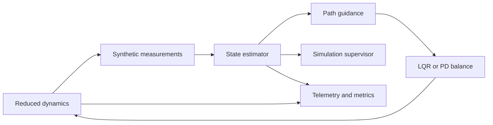

# Architecture

The portable core separates dynamics, estimation, control, safety, planning,
and experiment orchestration. Future ROS adapters should wrap these boundaries
without embedding hardware access in the numerical core. The existing v1
perception and ROS packages need interface reconciliation before integration.

Proposed ROS boundaries: bicycle_hardware, bicycle_state_estimation,
bicycle_perception, bicycle_world_model, bicycle_planning, bicycle_control,
bicycle_safety, bicycle_logging, bicycle_simulation, bicycle_bringup.
These are planned package names, not installed packages in this baseline.

Proposed topics (not yet implemented):

| Topic | Type | Publisher → consumer | Rate | Purpose |
|---|---|---|---|---|
| /imu/data | sensor_msgs/Imu | driver → estimator | 100 Hz | calibrated raw IMU |
| /gnss/fix | sensor_msgs/NavSatFix | driver → localization | 5 Hz | geodetic position |
| /joint_states | sensor_msgs/JointState | driver → estimator | 100 Hz | wheel and steering |
| /state/odometry | nav_msgs/Odometry | estimator → control/planning | 100 Hz | fused state |
| /world/occupancy | nav_msgs/OccupancyGrid | world model → planner | 10 Hz | free/occupied/unknown |
| /plan/path | nav_msgs/Path | planner → trajectory generator | 10 Hz | geometric path |

Actuator commands require a dedicated stamped interface with validity duration,
sequence, limits, and watchdog semantics before hardware integration. Nav Path
alone cannot represent speed, curvature and lean feasibility constraints.
Future TF: map → odom → base_link → sensor frames; x forward, y left, z up.
Each measurement must carry acquisition time and covariance. No wall-clock and
simulation-time mixing is allowed. MCUs must enforce a local monotonic watchdog.
