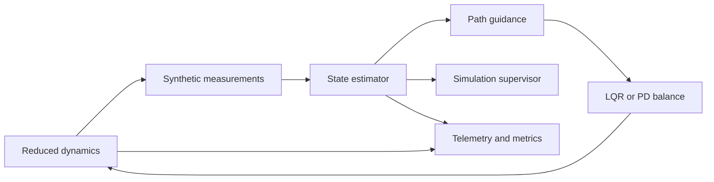

# Architecture

The portable core separates dynamics, estimation, control, safety, planning,
and experiment orchestration. `runtime.py` adds acquisition-stamped observations,
ordered fusion and command validation, shared by the standalone and ROS paths.
`research/ros2_ws` now implements plant, estimator, controller and recorder
processes in `bicycle_simulation`, with messages in `bicycle_interfaces`.
See [implemented ROS interfaces](docs/ROS.md). The existing v1 perception and
ROS packages still need calibration and timestamp adapters before integration.

Proposed ROS boundaries: bicycle_hardware, bicycle_state_estimation,
bicycle_perception, bicycle_world_model, bicycle_planning, bicycle_control,
bicycle_safety, bicycle_logging, bicycle_simulation, bicycle_bringup.
Most of these are planned package names; the current two packages above group
the initial transport adapters while preserving executable process boundaries.

Proposed topics (not yet implemented):

| Topic | Type | Publisher → consumer | Rate | Purpose |
|---|---|---|---|---|
| /imu/data | sensor_msgs/Imu | driver → estimator | 100 Hz | calibrated raw IMU |
| /gnss/fix | sensor_msgs/NavSatFix | driver → localization | 5 Hz | geodetic position |
| /joint_states | sensor_msgs/JointState | driver → estimator | 100 Hz | wheel and steering |
| /state/odometry | nav_msgs/Odometry | estimator → control/planning | 100 Hz | fused state |
| /world/occupancy | nav_msgs/OccupancyGrid | world model → planner | 10 Hz | free/occupied/unknown |
| /plan/path | nav_msgs/Path | planner → trajectory generator | 10 Hz | geometric path |

The simulation command interface now carries validity duration, sequence, limits,
and watchdog semantics. Hardware requires an independent protocol and validation. Nav Path
alone cannot represent speed, curvature and lean feasibility constraints.
Future TF: map → odom → base_link → sensor frames; x forward, y left, z up.
Each measurement must carry acquisition time and covariance. No wall-clock and
simulation-time mixing is allowed. MCUs must enforce a local monotonic watchdog.
