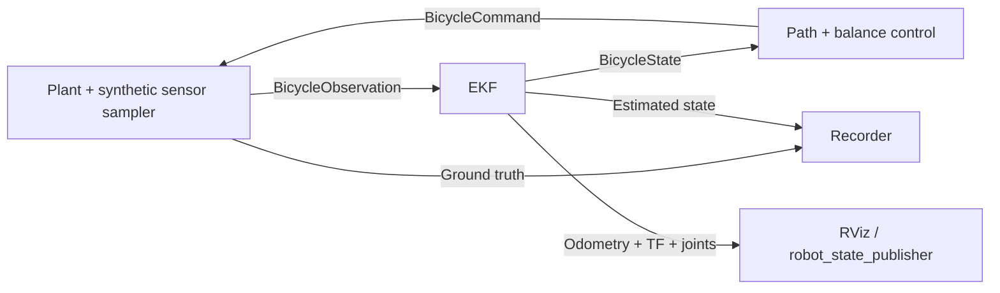

# ROS 2 simulation milestone

The numerical plant, EKF, controller and recorder run in four separate processes.
They exchange generated ROS messages. There is no hardware command publisher.
The existing v1 packages remain in the top-level `ros2_ws`; this milestone builds
only `research/ros2_ws`, avoiding incompatible legacy dependencies and topic formats.

## Run with Docker

From the repository root, with Docker available:

```sh
docker build -t pathfinder-ros -f research/docker/Dockerfile .
docker run --rm -v "${PWD}/runs:/workspace/runs" pathfinder-ros
```

This launches a 20-second simulated experiment, saves telemetry and metrics to
`runs/ros-latest`, then exits. It starts at 3 m/s; starting/stopping balance is not
modeled. The configuration is installed with the package. To change it, mount a
JSON file and pass `config:=/path/in/container.json` after the launch filename.

The image uses ROS 2 Jazzy on its supported Ubuntu base. Python numerical and test
dependencies are pinned in `pyproject.toml`; the ROS image tag and apt packages are
version-family pins, not immutable image/package digests. No GPU is required.
The image build is also the ROS build used by CI.

## Native ROS Jazzy installation

With ROS Jazzy, colcon, the pinned core dependencies, `tf2_ros_py`,
`robot_state_publisher`, and optionally RViz already installed:

```sh
python3 -m pip install -e ./research
bash research/scripts/build_ros.sh
source research/ros2_ws/install/setup.bash
ros2 launch bicycle_simulation simulation.launch.py rviz:=true
```

Use the Python environment that provides your ROS installation. Do not replace
Jetson system packages with the desktop dependencies. The Docker route avoids
native Python packaging conflicts; `--break-system-packages` is used only inside
the disposable image, never by the native build script.

RViz displays the estimated bicycle, reference path, odometry and TF. The URDF is
illustrative visual geometry, not Gazebo contact physics or a measured robot model.
GUI forwarding into Docker depends on the host display configuration; CI validates
the published visual inputs, not a rendered RViz screenshot.

## Runtime



The plant publishes frame zero after graph discovery, then advances exactly one
step for each matching command. It supplies `/clock`. Wall-clock timers schedule
work even when `/clock` is paused. This is deterministic **lockstep simulation**,
not a demonstration of real-time schedulability or a hardware transport protocol.

The controller and estimator never subscribe to ground truth. Observations include
the actual command applied over their preceding interval, so EKF prediction and
measurements refer to the same acquisition time. Missing, duplicate, out-of-order
or invalid frames are rejected. A default two-second wall-clock command watchdog
freezes the plant if the pipeline stops; this deliberately generous software-test
timeout is not suitable as a physical actuator watchdog.

`/bicycle/estop` (`std_srvs/Trigger`) latches a simulated emergency stop. The plant
freezes, the recorder saves available data, and launch shuts down. A new process
launch is needed to reset. No braking/stationary balance behavior is claimed.

```sh
ros2 service call /bicycle/estop std_srvs/srv/Trigger '{}'
```

Completion is announced only after the final state is acknowledged by the
controller. The recorder joins state/truth by sequence and acquisition stamp,
waits for the final pair, and flags incomplete recordings in `metrics.json`.
The CSV contains every truth/estimate sample; the JSON stores the actual config.
For full message recording, start `ros2 bag record` before the launch, including
`/clock`, `/bicycle/observations`, `/bicycle/state`, `/bicycle/command`,
`/bicycle/truth`, `/bicycle/status`, `/tf`, and `/tf_static`.

## Implemented interfaces

All topics except `/clock`, `/tf` and `/tf_static` are under `/bicycle`.
Rates below are **simulated-time** rates for the default 10 ms timestep; wall time
depends on `real_time_factor` and the slowest process. Ordinary data uses reliable,
volatile QoS, depth 10; recorder queues use depth 100. Status/reference are reliable
and transient-local, depth 1. No perception output is treated as metric space here.

| Topic | Message | Publisher → consumers | Rate / meaning |
|---|---|---|---|
| observations | BicycleObservation | plant → estimator | 100 Hz; attitude solution + encoders, local GNSS at 5 Hz |
| state | BicycleState | estimator → control, recorder | 100 Hz; estimate and covariance |
| command | BicycleCommand | controller → plant | 100 Hz; steer/accel, source frame sequence and validity |
| truth | BicycleState | plant → recorder | 100 Hz; explicitly simulated ground truth |
| odometry | nav_msgs/Odometry | estimator → RViz | 100 Hz; map pose and body twist |
| sensors/attitude | sensor_msgs/Imu | estimator adapter → visualization | 100 Hz; synthetic orientation only, unavailable gyro/accel flagged -1 |
| joint_states | sensor_msgs/JointState | estimator adapter → robot_state_publisher | 100 Hz; encoder steering, integrated synthetic wheel speed |
| reference | nav_msgs/Path | plant → RViz | latched analytic route |
| status | std_msgs/String | plant → recorder/probes | JSON: mode, reason, sequence, simulated time, data source |
| /clock | rosgraph_msgs/Clock | plant → ROS nodes | once per frame |

State order: x, y, yaw, speed, left lean, left lean rate, left steering (SI).
Covariance is row-major 7×7 in that order. GNSS is local x/y, never a fabricated
NavSatFix. Command validity is 20 ms of simulation time by default; acceptance
requires the current observation's stamp/sequence and validity through the next
step. Finite values and actuator bounds are checked independently at the plant.

TF: `map → base_link → rear_wheel / steering_link / imu_link / camera_link`,
`steering_link → front_wheel`, `camera_link → camera_optical_frame`.
Map is local ENU with x forward initially, y left, z up. No separate odom frame
is invented because this EKF is currently a single local estimator. Internal lean
is left-positive; ROS roll is its negative. Covariance cross terms follow that sign.
Unestimated z/pitch covariance is explicitly large.

## v1 compatibility boundary

Inspected v1 code publishes `/laneatt/left_lane`, `/laneatt/right_lane` and
`/laneatt/mid_lane` as unstamped `Float32MultiArray`; the object controller publishes
`Int8` on `/bicycle/speed_command`, while the old Stanley node publishes `Twist` on
`/cmd_vel`. These are not interchangeable with a time-bounded steering command.
No adapter connects them to the new plant. Next perception work must add image
acquisition stamps, calibration, frame names and metric/relative-depth validity
before generating world-space constraints. Lane pixels alone are not free space.

## Validation

Portable tests check ordered fusion, command rejection, coordinate signs and
byte-identical deterministic results between the transport components and the
standalone simulation. ROS integration tests build real message generators, launch
real nodes, inspect odometry/TF, measure tracking, kill the controller to exercise
the wall-clock watchdog, and call the emergency-stop service. See CI results and
`STATUS.md` for what has actually been run.

References: [ROS Jazzy rclpy source](https://github.com/ros2/rclpy/tree/jazzy/rclpy),
[tf2 ROS Python](https://github.com/ros2/geometry2/tree/jazzy/tf2_ros_py),
[rosidl interface generation](https://github.com/ros2/rosidl/tree/jazzy/rosidl_cmake).
